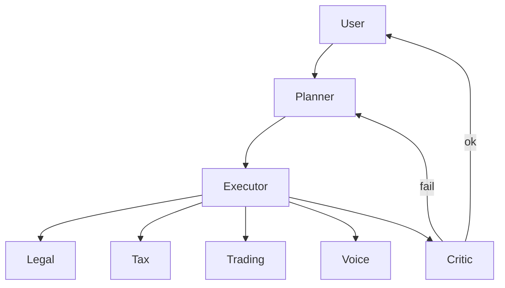

# AGENTS.md — EAOS Agent Roles

## Agent Roster

| Agent | Role | Input | Output | Status |
|-------|------|-------|--------|--------|
| **Planner** | Query → Task Decomposition | natural language query | list of tasks with type/params | DONE |
| **Executor** | Dispatch to Specialists | tasks | aggregated results per task | DONE |
| **Critic** | Validate + Retry | execution result | ok/retry + issues | DONE |
| **Legal RAG** | Legal QA with citations | query | answer + citations + snippets + retrieval_method | DONE (vector+lexical) |
| **Router** | Privacy-first LLM routing | query + task_type | provider (local/cloud) + redactions | DONE |
| **Redaction** | PII removal | text | redacted text + hits | DONE |
| **Voice** | STT→redact→route→LLM→TTS | audio bytes | transcript + route + answer | DONE (template) |
| **Trading Guardrails** | Risk checks | order_value, equity, position | ok + reason | DONE |
| **Tax Adapters** | Tax computation | taxable_minor, jurisdiction | tax_minor | DONE (US/IR) |
| **Finance Ledger** | Double-entry posting | postings | JournalEntry + hash chain | DONE |

## Orchestration Flow

## How to Extend

- Add new specialist: implement in `packages/<name>/`, register in `planner.py` patterns + `executor.py` dispatch + `critic.py` validation
- Add new tax jurisdiction: implement `TaxAdapter` in `packages/tax/adapters.py`, add to `ADAPTERS`
- Add new RAG KB: update `packages/legal/kb.json`, vector store auto-reindexes

## Testing

- Unit: `pytest tests/test_<module>.py -v`
- E2E: `pytest tests/test_e2e_orchestration.py -v` (mocks LLM)

## ENV

See `.env.example` — no secrets required for local-first run.
