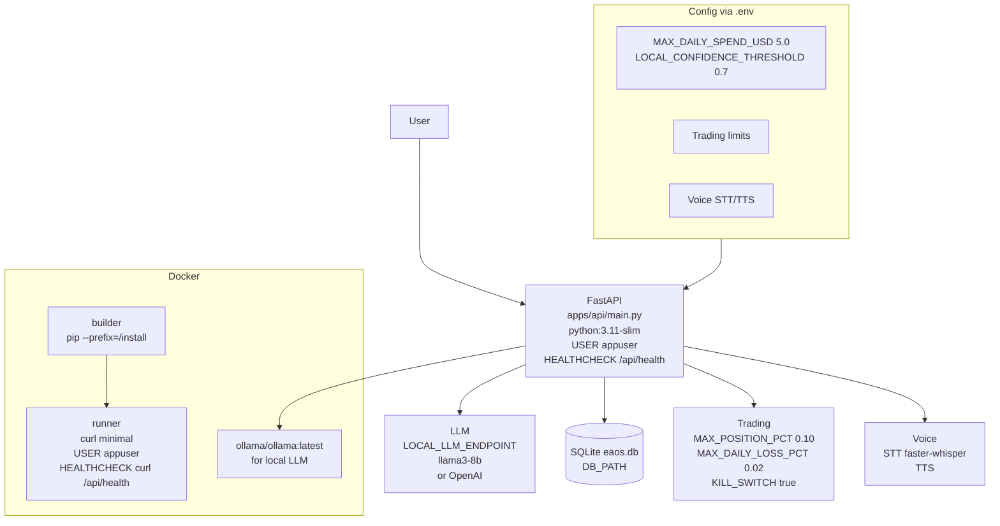

# ARCHITECTURE.md — eaos — Enterprise Agent OS

## ۶. eaos — Enterprise Agent OS (Local-First)

### Purpose
Local-first enterprise agent OS: LLM, trading, voice STT/TTS, phases 13-16, kill switch, confidence threshold, max daily spend.

### Graph

### Connections
- **API → LLM:** Via LOCAL_LLM_ENDPOINT or OPENAI_API_KEY, with MAX_DAILY_SPEND and CONFIDENCE_THRESHOLD
- **API → Trading:** With kill switch, max position %, max daily loss %
- **API → Voice:** STT faster-whisper, TTS
- **API → DB:** SQLite eaos.db

### Modern Standards Check
- ✅ **Local-First:** No cloud required, Ollama local, SQLite, no hardcoded secrets
- ✅ **Safety:** Kill switch, max position, max daily loss, confidence threshold, max daily spend
- ✅ **Modular:** apps/api, packages, configs — separation
- ✅ **Docker:** Multi-stage, USER appuser, HEALTHCHECK, curl minimal
- ✅ **Testing:** 42 tests, ruff 0, 0 any, 0 console.log
- ⚠️ **Product Gap:** Needs phases 13-16 real embeddings pgvector, Temporal prod, voice STT/TTS real, trading live

### Deep Issues Fixed
- **Root Docker:** Fixed to USER appuser multi-stage

---

