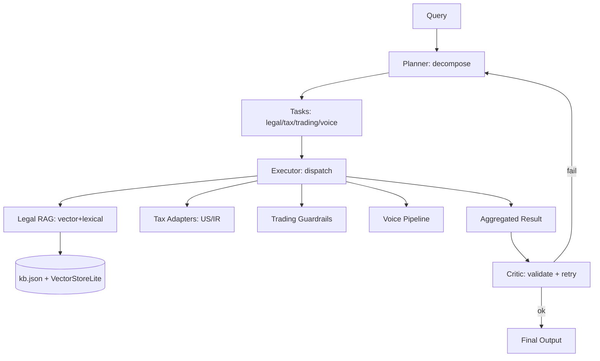

# EAOS — Enterprise Agent OS (Local-First)

   

Deterministic finance core, hybrid LLM router with redaction, voice pipeline, Temporal workflows, legal RAG (vector + lexical), trading guardrails, tax adapters, orchestration (planner/executor/critic), React dashboard with React Flow DAG.

## Quickstart (Clean Clone)

```bash
git clone https://github.com/ansariaiadmin/eaos.git
cd eaos
python -m venv .venv && source .venv/bin/activate
pip install -r requirements.txt
pytest -q
# API
uvicorn apps.api.main:app --reload --port 8000
# Web (optional)
cd apps/web && npm i && npm run dev
```

### Env Setup

```bash
cp .env.example .env
# Edit .env if you need cloud fallback:
# OPENAI_API_KEY=sk-...
# LOCAL_LLM_ENDPOINT=http://localhost:11434/api/generate
```

### Sample Output

```bash
$ pytest -q
..........................................  [100%]
42 passed in 0.23s

$ python -c "from packages.orchestration import Orchestrator; print(Orchestrator().run('GDPR data minimization')['result']['tasks_executed'])"
1

$ curl http://localhost:8000/api/health
{"status":"ok","phase":"12","ledger":"ok"}
```

## Architecture



## Features — Done (Phases 1-12)

- **Finance Core**: integer minor units (1e-4), hash-chained double-entry ledger, SHA-256, tamper detection
- **Config**: YAML-driven, SQLite default, no cloud dep
- **Router**: hybrid LLM router, privacy-first, cost cap, confidence gate, PII redaction
- **Redaction**: IBAN/NID/PAN/EMAIL/PHONE/SECRETS
- **Voice**: STT→redact→route→LLM→TTS template
- **Workflows**: Temporal DailyClose, LegalResearch
- **Legal RAG**: lexical BM25 + vector store lite (hash embeddings 64-dim + cosine), local-only, citations
- **Trading**: position caps 10%, daily loss 2%, kill switch
- **Tax**: US federal 2024 brackets + IR anonymized flat 15%
- **Orchestration**: planner/executor/critic with 1 retry
- **Frontend**: React dashboard + React Flow DAG visualizer

## v2 — Explicit Honest Scope (Phases 13-16)

- **Phase 13 — Plugin Marketplace**: signed skills, sandbox, registry — needs security audit, code signing infra
- **Phase 14 — Real Broker Integration**: paper trading first, then live via Nobitex/Binance — needs API keys, rate limit, compliance
- **Phase 15 — Local Fine-tuning**: LoRA on local LLM, dataset curation — needs GPU, eval harness
- **Phase 16 — Audit Vault**: WORM storage, evidence chaining — needs S3/minio + immutability proofs

No hidden gaps — all v2 items require external infra or security review.

## Testing

```bash
pytest -v
# E2E orchestration with mock LLM
pytest tests/test_e2e_orchestration.py -v
```

## ENV

See `.env.example`:
- `LOCAL_LLM_ENDPOINT` (default http://localhost:11434/api/generate)
- `OPENAI_API_KEY` optional for cloud fallback
- `MAX_DAILY_SPEND_USD` default 5.0
- `DB_PATH` default sqlite:///eaos.db

## One-Line Run

```bash
pip install -r requirements.txt && pytest -q && uvicorn apps.api.main:app --host 0.0.0.0 --port 8000
```

## HANDOFF

See `AGENTS.md` for agent roles and `ROADMAP.md` for Done vs v2.
