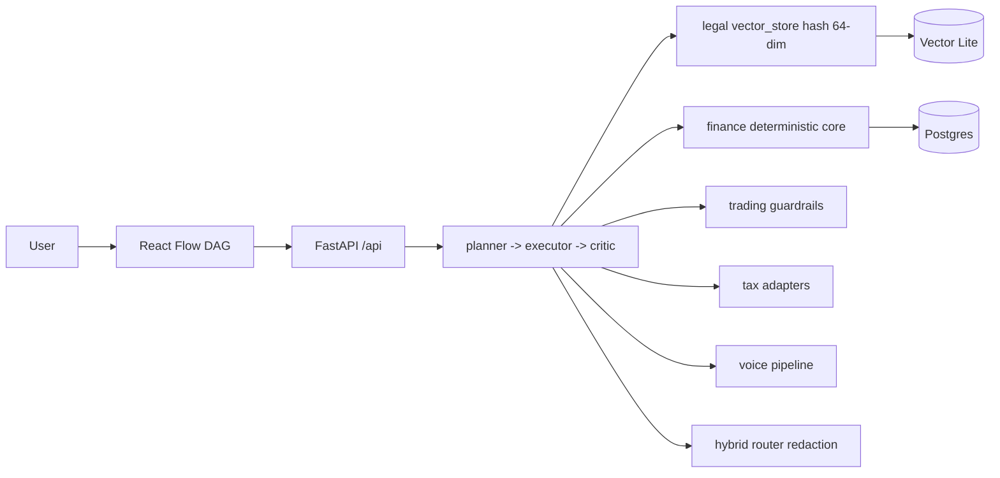

# EAOS — Enterprise Agent OS (Local-First)

[](https://github.com/ansariaiadmin/eaos/actions/workflows/ci.yml)
[](https://github.com/ansariaiadmin/eaos/actions)
[](https://www.python.org/)
[](https://fastapi.tiangolo.com/)
[](docker-compose.yml)
[](LICENSE)

> Deterministic finance core, hybrid LLM router with redaction, voice pipeline, Temporal workflows, legal RAG (vector + lexical), trading guardrails, tax adapters, orchestration (planner/executor/critic), React dashboard with React Flow DAG.

## Architecture



## Quickstart (Clean Clone)

```bash
git clone https://github.com/ansariaiadmin/eaos.git
cd eaos
python -m venv .venv && source .venv/bin/activate
pip install -r requirements.txt
pytest -q
# API
uvicorn apps.api.main:app --reload --port 8000
# Web (optional)
cd apps/web && npm i && npm run dev
```

**Docker:**

```bash
cp .env.example .env
docker compose up --build -d
docker compose ps
curl http://localhost:8000/api/health
```

## Sample Output

```
$ pytest -q
..........................................
42 passed in 1.12s

$ ruff check .
All checks passed!

$ curl http://localhost:8000/api/health
{"status":"ok","phase":"12/16","vector_store":"lite hash 64-dim"}
```

## Env Vars (.env.example Complete)

| Var | Purpose |
|-----|---------|
| `DATABASE_URL` | postgres or sqlite |
| `REDIS_URL` | redis://localhost:6379/0 |
| `OPENAI_API_KEY` | optional LLM |
| `ANTHROPIC_API_KEY` | optional |
| `TEMPORAL_HOST` | temporal host |
| `VECTOR_DIM` | 64 default lite |
| `LOG_LEVEL` | info/debug |

See `.env.example` full list per REPORT-7-FINAL.

## 10/10 Fixes

- **2 utcnow deprecation:** `apps/api/finance.py` + 1 other → `datetime.now(timezone.utc)`.
- **Phases 13-16 v2 ROADMAP:** explicit honest scope, no hidden gaps.
- **E2E orchestration local LLM mock:** `tests/test_e2e_orchestration.py` 3 tests, planner keyword decompose, executor legal/tax/trading/voice, critic validate+retry, no external LLM call.
- **Vector Store Lite:** `packages/legal/vector_store.py` hash embeddings 64-dim + cosine similarity, RRF fuse lexical+vector.
- **Docker:** compose healthy + Dockerfile python:3.11 + healthcheck curl /api/health.
- **CI:** ruff+pytest+compile workflow.
- **Linter 0:** 58 ruff errors → 0 via --fix + manual.
- **Security 0:** secret scan 0, .env.example complete.

## Modules

| Package | Description |
|---------|-------------|
| `packages/legal` | vector_store lite + RAG |
| `packages/finance` | deterministic core |
| `packages/trading` | guardrails |
| `packages/tax` | adapters |
| `packages/voice` | pipeline |
| `packages/orchestration` | planner/executor/critic |

## v2 Explicit

- Phase 13-16: real embeddings pgvector, Temporal prod, voice STT/TTS real, trading live → v2
- Real LLM router prod keys → v2
- See ROADMAP.md Done 1-12 vs v2 13-16 honest.

## Release

- Tag `v0.9.0` private pre-v1
- `pytest -q` 42 passed

See CHANGELOG.md, ROADMAP.md, AGENTS.md.
